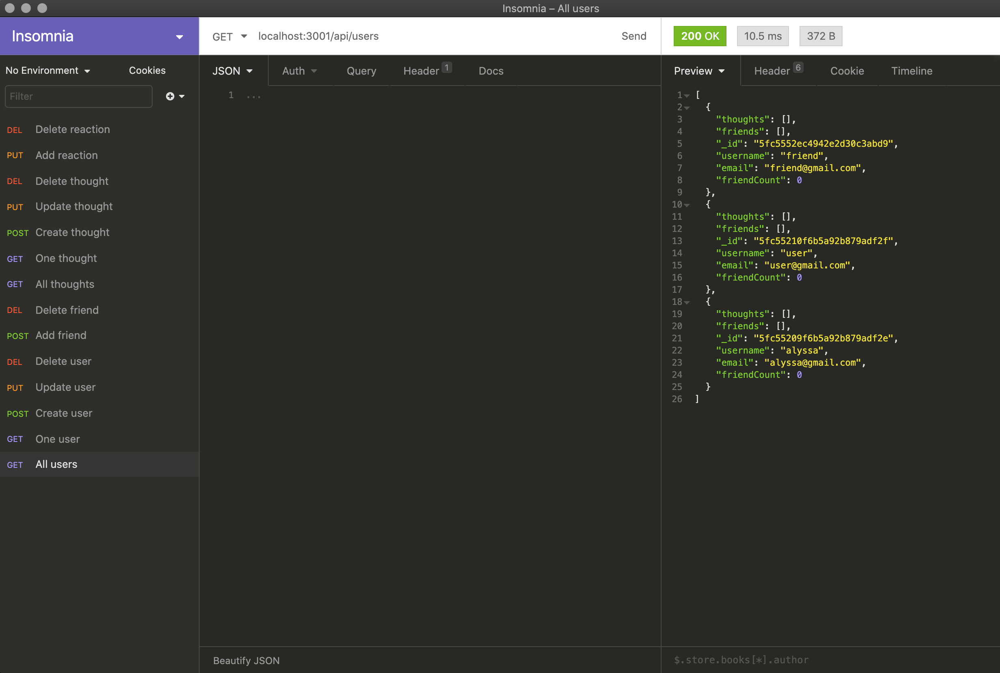

# Social Network API

## Purpose
This is a NoSQL database API for a social media network so they can handle large amounts of unstructured data.

## Screenshot & Video
[Walkthrough Video](https://drive.google.com/file/d/12YOcTSfweWWapbRC-9krMUYKYZKO9n0P/view) 

## Links
[GitHub Repo](https://github.com/apklopfenstein/social-network)